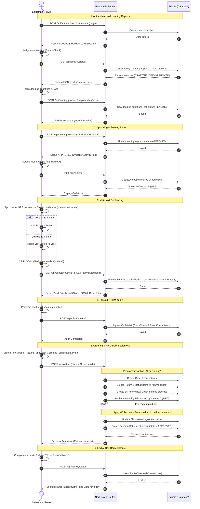

# Salesman Tools Project Documentation

This document provides a detailed overview of the **Salesman Tools** project, including the technology stack, file structure, domain glossary, instructions on how to read and improve the codebase, and step-by-step program and API flows.

---

## 📋 Table of Contents
1. [Technology Stack](#-technology-stack)
2. [Project Directory Structure](#-project-directory-structure)
3. [Glossary of Terms](#-glossary-of-terms)
4. [How to Read & Understand the Codebase](#-how-to-read--understand-the-codebase)
5. [Program & Data Flow](#-program--data-flow)
   - [Authentication & Dashboard](#1-authentication--dashboard)
   - [Morning Prep: Loading Reports](#2-morning-prep-loading-reports)
   - [The Route Listing & Geofencing](#3-the-route-listing--geofencing)
   - [Store Check-In & Audits](#4-store-check-in--audits)
   - [Order Entry & FIFO Debt Settlement](#5-order-entry--fifo-debt-settlement)
   - [End of Day Route Closure](#6-end-of-day-route-closure)
6. [Recommendations for Improvement](#-recommendations-for-improvement)

---

## 🛠️ Technology Stack

The project is built on a modern full-stack JavaScript ecosystem tailored for mobile-first user experiences:

* **Core Framework**: [Next.js (v16.2.7)](https://nextjs.org) using the **App Router** architecture.
* **UI & Rendering**: [React (v19.2.4)](https://react.dev) with [TypeScript](https://www.typescriptlang.org).
* **Styling**: [Tailwind CSS (v4)](https://tailwindcss.com) utilizing `@tailwindcss/postcss` for lightning-fast modern design tokens.
* **Component Library**: [Shadcn UI](https://ui.shadcn.com) for modular, accessible interfaces, built on top of [Radix/Base UI](https://base-ui.com).
* **Icons**: [Lucide React](https://lucide.dev) for clean, vector-based iconography.
* **Database & ORM**: [Prisma (v5.22.0)](https://www.prisma.io) as the Object-Relational Mapper, connected to a database (configured for PostgreSQL via `schema.prisma`, but runs on a local SQLite `dev.db` for development).
* **Authentication**: [NextAuth.js (v5.0.0-beta.31)](https://next-auth.js.org) for session tracking and user login management.
* **State Management**: [Zustand](https://github.com/pmndrs/zustand) for client-side state and [TanStack React Query](https://tanstack.com/query) for asynchronous server-state fetching and caching (defined in dependencies).
* **Forms & Validation**: [React Hook Form](https://react-hook-form.com) and [Zod](https://zod.dev) for schemas and request body validations.
* **Maps & Geolocation**: [Leaflet](https://leafletjs.com) and [React Leaflet](https://react-leaflet.js.org) for geographic mapping, with fallback embedding via OpenStreetMap iframe.
* **Progressive Web App (PWA)**: `@ducanh2912/next-pwa` to convert the app into a mobile-installable home screen app that loads offline assets.

---

## 🗂️ Project Directory Structure

```text
sales/
├── app/                  # Next.js App Router root
│   ├── (auth)/           # Route group for unauthenticated pages
│   │   └── login/        # Login page (/login)
│   ├── (app)/            # Route group for authenticated layouts
│   │   ├── dashboard/    # Performance metrics dashboard (/dashboard)
│   │   ├── activity/     # Loading reports & daily outlet visit routes (/activity)
│   │   ├── visit/        # Geofenced visit workspace (/visit/[outletId])
│   │   └── layout.tsx    # Inject BottomNav tab bar
│   ├── api/              # API Route Handlers (Back-end)
│   │   ├── activity/     # Route closure and daily loading status checks
│   │   ├── auth/         # NextAuth wildcards ([...nextauth]/route.ts)
│   │   ├── bills/        # Payment settlement requests and approvals
│   │   ├── dev/          # Debug helpers (e.g. approve-all loading reports)
│   │   ├── loading/      # Submitting product and POSM loading reports
│   │   ├── orders/       # Order submissions & FIFO payment distribution
│   │   ├── outlets/      # Outlet profiles, new registrations, and route re-ordering
│   │   ├── products/     # Catalog fetch
│   │   └── posms/        # POSM catalog fetch
│   ├── globals.css       # Global styles (Tailwind imports)
│   ├── layout.tsx        # Base HTML layout structure
│   ├── providers.tsx     # SessionProvider configuration wrapper
│   └── page.tsx          # Root URL page (redirects to /login)
├── components/           # Reusable UI Components
│   ├── navigation/       # Mobile tab layouts (bottom-nav.tsx)
│   └── ui/               # Shadcn/Radix components (buttons, input, cards, etc.)
├── lib/                  # Helper utilities and initializers
│   ├── auth.ts           # NextAuth configuration and verification logic
│   ├── prisma.ts         # Singleton database client instance
│   └── utils.ts          # Classname merger (clsx + tailwind-merge)
├── prisma/               # Database files
│   ├── dev.db            # Local SQLite database file (SQLite)
│   ├── schema.prisma     # Main Prisma schema defining database entities & relations
│   └── seed.ts           # Seeding script for products, POSM, and mock outlets
├── public/               # Static assets (pwa manifests, images, etc.)
├── package.json          # Dependencies & npm script configurations
└── tsconfig.json         # TypeScript configurations
```

---

## 📖 Glossary of Terms

Understanding the business logic domain terms used throughout the database schema and interfaces:

* **Salesman (User)**: The primary user of the mobile app. Drives a delivery vehicle, registers new outlets, checks shelf inventory, delivers orders, and collects payments.
* **Product**: Items in the catalog that the salesman sells to outlets (e.g. beverages, snacks, goods).
* **POSM (Point of Sales Materials)**: Visual marketing materials installed in stores to boost sales (e.g. banners, display stands, retail racks).
* **Outlet**: A customer retail store visited by the salesman. Outlets are associated with a specific **Route Group**, a sequence number (`routeSeq`), PIC contact information, GPS coordinates, and an exterior storefront photo.
* **Route Group**: A cluster of outlets grouped geographically (e.g., "Route A", "Route B", "Route C"). The salesman focuses on one Route Group per day.
* **Route Sequence (`routeSeq`)**: The scheduled visiting order of stores within a route. The salesman can shift this sequence (up/down) to adjust to road conditions.
* **Route Closure**: A daily locking action. Once a route is closed by the salesman at the end of the day, no further check-ins, orders, or loading reports can be performed until the following day.
* **Loading Report (Product / POSM)**: A checklist completed by the salesman in the morning, declaring the quantities of products and POSM items loaded from the warehouse into their vehicle. Must be `APPROVED` before route visits can begin.
* **Outlet Visit**: A registered check-in at a retail store. The salesman conducts two audits:
  1. **Stock Check**: Audits the store's current shelf stock levels of the catalog products.
  2. **POSM Check**: Audits the condition and quantity of POSM marketing items present.
* **Geofencing Restriction**: A security constraint. The salesman's GPS coordinates must be within **50 meters** of the outlet's registered location coordinates to enable check-in/visitation.
* **Bill (Receivable)**: An invoice created automatically whenever an order is submitted with terms. Tracks the value, settled payments, and outstanding balances of the outlet.
* **Payment Settlement**: A payment made by the outlet to reduce outstanding bills.
  * *Standalone Settlements*: Created from the bill list as `PENDING` and require back-office admin approval.
  * *Order Collections*: Handled directly during order checkouts, marked as `APPROVED` automatically because they are validated alongside physical order receipts.
* **FIFO Settlement (First-In, First-Out)**: A payment allocation algorithm. When cash collections or returned items are applied to an outlet, the system automatically pays off the oldest unpaid bills first.
* **Nota / Receipt Photo**: A photo proof of the paper invoice and products delivered, required to submit any order.

---

## 🔍 How to Read & Understand the Codebase

Follow this roadmap to learn the code architecture:

1. **Start at the Schema (`prisma/schema.prisma`)**:
   Review the tables and relation keys. For example, look at how `Order` links to `Bill` via a `one-to-one` relation, and how `Bill` has a `one-to-many` relationship with `PaymentSettlement` to track installments.
2. **Examine the Auth Handler (`lib/auth.ts` & `app/api/auth/[...nextauth]/route.ts`)**:
   Observe how NextAuth handles user session mapping. Note the development shortcut: if a typed username does not exist, the app automatically creates it in the database with the plain password so developers can log in instantly.
3. **Analyze Tab-Level Views (`app/(app)/activity/page.tsx`)**:
   This page is the heart of the daily workflow. It handles the transition between three tabs (`product` -> `posm` -> `activity`) based on API status values. Inspect `fetchStatus` to see how the frontend knows if the morning loading reports are approved.
4. **Inspect the Core Business Transaction (`app/api/orders/route.ts`)**:
   This is the most critical backend file. It uses `prisma.$transaction` to guarantee database consistency. Study the FIFO logic (lines 101–146) to see how payments and return credits loop through outstanding bills to deduct balances.
5. **Study Client-Side Browser Integrations**:
   Look at how `navigator.geolocation.getCurrentPosition` is utilized in `DailyActivityTab` to enforce geofencing, and how file inputs with `capture="environment"` prompt the physical camera on a mobile browser to snap storefront and invoice photographs.

---

## 🔄 Program & Data Flow

Below is the step-by-step lifecycle of a salesman's day, tracing the front-end pages to back-end APIs.



---

## 📈 Recommendations for Improvement

Here are strategic ways to clean up, secure, and scale this project:

### 1. Security: Server-Side Route Protection (Middleware)
* **Current State**: Authentication checks are performed inside page components using `useSession` and inside API files manually. There is no edge-level gateway.
* **Improvement**: Create a root-level `middleware.ts` utilizing NextAuth's built-in authorized callbacks to block `/dashboard`, `/activity`, and `/visit` paths at the routing level.

### 2. Security: Password Hashing
* **Current State**: The `lib/auth.ts` file saves passwords in plain text during auto-generation and checks them using raw equivalence comparisons.
* **Improvement**: Install `bcryptjs` or `argon2`. Hash the user's password during signup/creation and use `bcrypt.compare` inside the `authorize` callback.

### 3. Developer UX: Debug / Test Mocking Toggle
* **Current State**: Geofencing checks block developer testing in local development because coordinates don't match the mock coordinates of "Warung Pak Bejo" or others.
* **Improvement**: Introduce an environment variable (e.g. `NEXT_PUBLIC_BYPASS_GEOFENCE=true`) to let developers testing on desktops bypass the 50-meter GPS restriction.

### 4. Code Architecture: State Caching (React Query / Zustand)
* **Current State**: Pages fetch endpoints directly using `fetch` inside `useEffect` calls. This causes redundant calls on tab switches and child components re-rendering.
* **Improvement**: Migrate network states to **TanStack React Query** (already in `package.json`). Wrap query hooks around `/api/outlets` and `/api/activity/status` for smart background updates and client-side caching. Use **Zustand** for local shopping cart state in the order placement workspace.

### 5. Back-Office: Admin Dashboard
* **Current State**: Standalone payment settlements and loading reports submit to the database as `PENDING`, but there is no built-in screen to approve them (except the developer test `/api/dev/approve-all` script).
* **Improvement**: Implement an `/admin` route group restricted to `role === "ADMIN"` where warehouse managers can review and approve daily loading entries, and finance teams can approve payment settlements.

### 6. Mobile Resilience: Offline Drafting (Fully Implemented)
* **Status**: ✅ **Implemented & Integrated**
* **Details**: Integrated browser **IndexedDB** (`lib/offline-db.ts`) to manage:
  - Cache stores for local fallback of `outlets`, `products`, `posms`, and `activity_status`.
  - Draft stores for offline `stockChecks`, `posmChecks`, and `order` entries (including photo attachments as base64 strings).
  - Dynamic `online`/`offline` listeners in `/visit/[outletId]` to toggle an amber badge.
  - A synchronizer dashboard panel at the top of `/activity` that detects offline drafts and allows syncing them in order when connection is restored.
