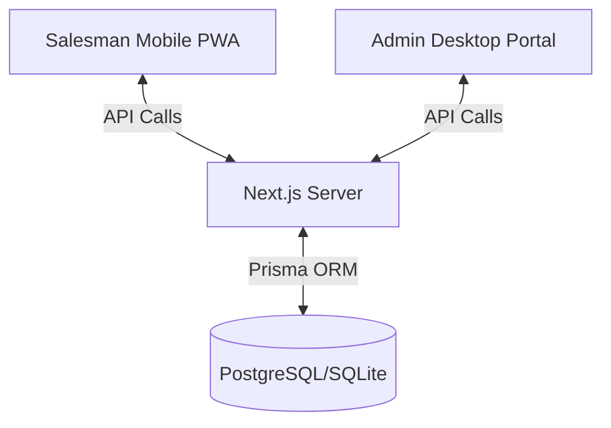
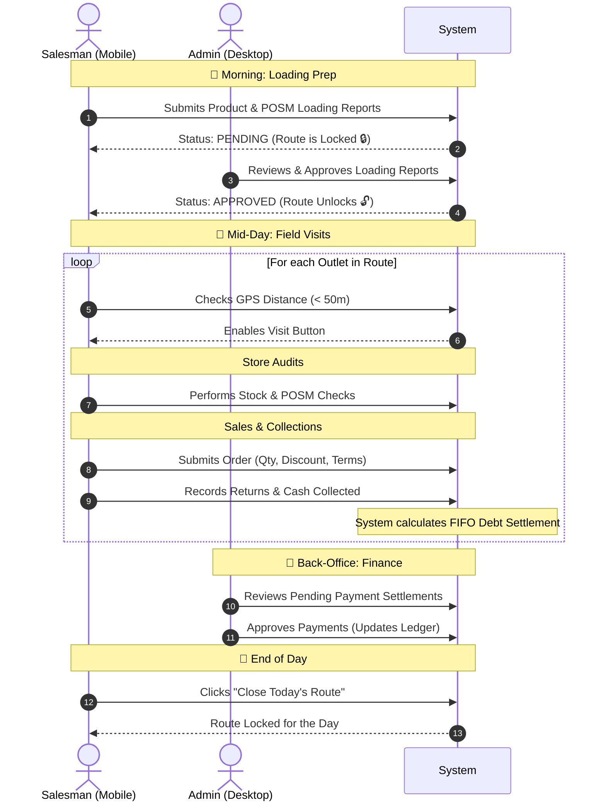

# Salesman Tools

A mobile-first Progressive Web App (PWA) built with **Next.js** for field sales teams. 

> 📖 For deep technical reference (schema, API flows, glossary, deployment), see **[DOCUMENTATION.md](./DOCUMENTATION.md)**.

---

## 🔄 End-to-End App Flow

The application handles the complete daily cycle of a field salesman and the corresponding approval actions by the back-office admin.

### High-Level Architecture



### Daily Operational Flow


---

## 🚀 Quick Start

```bash
# Install dependencies
npm install

# Setup local database & seed data
npx prisma migrate dev
npx prisma db seed

# Run the dev server
npm run dev
```

Open [http://localhost:3000](http://localhost:3000) to view the app.
